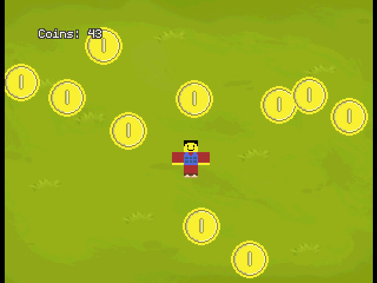

# N64 2D Coin Game Example
https://github.com/user-attachments/assets/a48eeff5-7574-4eb0-89c7-70c0c3e915fb



An N64 program that showcases an example 2D coin collecting game.

## How to Build N64 2D Coin Game Example
This tutorial assumes you have your N64 Toolchain set up including GCC for MIPS.
Make sure you are on the preview branch of libdragon.

Clone this repository with `--recurse-submodules` or if you haven't run:

```bash

git submodule update --init
```
---
Initialize libdragon:
```bash
libdragon init
```
Then run make to build this project:

```bash
libdragon make
```

---

## Licenses

Everything in the src folder is licensed under The Unlicense. See [LICENSE page](https://github.com/Aftersol/n64_coin_demo/blob/main/LICENSE) for more info.

In the assets folder the following assets are in the public domain:
- [player.png - Aftersol](./assets/player.png)
- [coin.png - Aftersol](./assets/coin.png)
- [hassekf - Tower Defense - Grass Background](https://opengameart.org/content/tower-defense-grass-background)
- [Luke.RUSTLTD - 8-bit Coin Sound](https://opengameart.org/content/10-8bit-coin-sounds)
